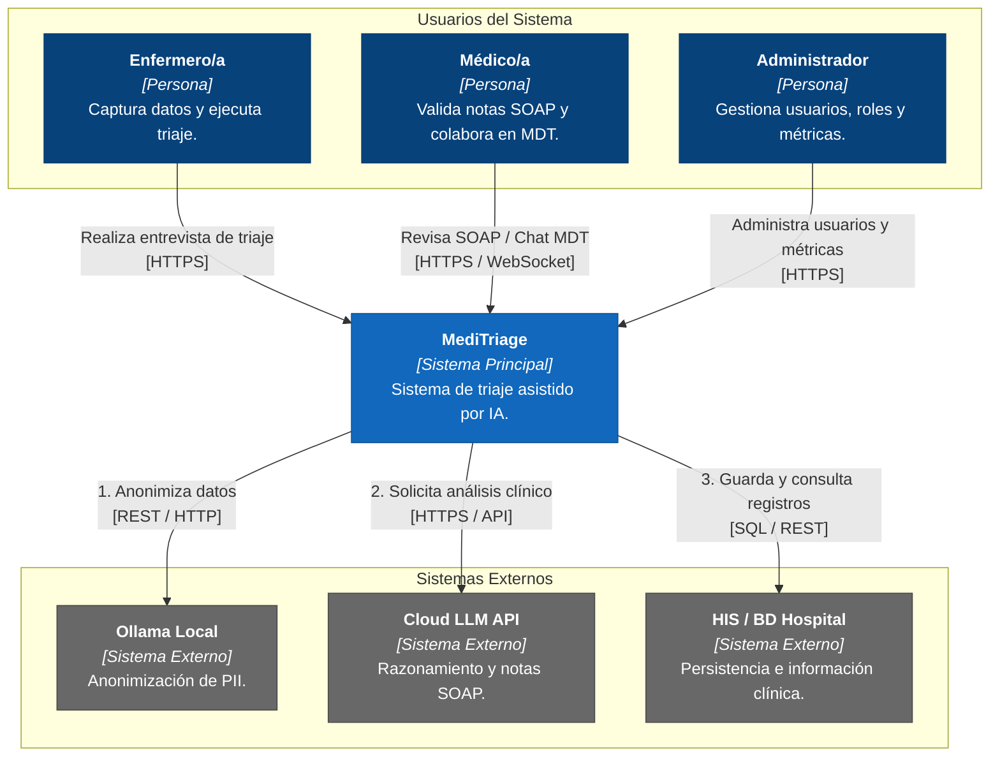

# C4 - Nivel 1: Diagrama de Contexto del Sistema (MediTriage)

## 1. Propósito

El objetivo de este diagrama es ilustrar el límite del sistema **MediTriage**, mostrando cómo interactúan los usuarios clínicos con él y cómo se integra con sistemas externos de soporte de IA e infraestructura hospitalaria.

---

## 2. Diagrama de Contexto

---

## 3. Descripción de Elementos

### 3.1 Usuarios

| Actor | Descripción | Responsabilidad Principal |
| :--- | :--- | :--- |
| **Enfermero/a** | Personal clínico de primera línea. | Captura constantes vitales, síntomas y ejecuta el proceso de triaje. |
| **Médico/a** | Profesional médico tratante o especialista. | Valida y corrige las notas SOAP generadas por IA y participa en la colaboración clínica. |
| **Administrador** | Personal de TI u operaciones hospitalarias. | Gestiona accesos, roles, auditorías y métricas del sistema. |

### 3.2 Sistemas

| Sistema | Tipo | Descripción |
| :--- | :--- | :--- |
| **MediTriage** | Sistema Central | Plataforma web/móvil que gestiona el flujo de triaje asistido por IA y colaboración médica. |
| **Ollama Local** | Sistema Externo | Servicio local encargado de anonimizar la información sensible del paciente antes de enviarla a servicios externos. |
| **Cloud LLM API** | Sistema Externo | Servicio de inteligencia artificial utilizado para el razonamiento clínico y la generación de notas SOAP. |
| **HIS / Base de Datos Hospital** | Sistema Externo | Sistema de información hospitalaria responsable del almacenamiento permanente de los registros clínicos. |

---

## 4. Alcance del Sistema

### Dentro del alcance de MediTriage

- Captura asistida de datos de triaje.
- Anonimización local de información sensible (PII).
- Generación y edición interactiva de notas SOAP.
- Comunicación en tiempo real mediante salas de discusión multidisciplinaria (MDT).
- Gestión de usuarios y permisos del sistema.

### Fuera del alcance

- Administración histórica de fichas clínicas a largo plazo (delegado al HIS).
- Entrenamiento o fine-tuning de los modelos de inteligencia artificial.
- Autenticación corporativa externa (Active Directory, OAuth u otros servicios institucionales).

---

## 5. Decisiones de Arquitectura

### Privacidad y Cumplimiento
Se adopta una arquitectura híbrida de inteligencia artificial. Los datos identificables del paciente son anonimizados localmente mediante Ollama antes de enviarse a servicios de IA en la nube.

### Comunicación en Tiempo Real
La colaboración entre profesionales clínicos se realiza mediante WebSockets para facilitar la toma de decisiones sincrónica durante emergencias y reuniones multidisciplinarias.

### Integración Hospitalaria
La persistencia de la información clínica se delega al sistema HIS institucional, evitando duplicidad de registros y manteniendo la integración con la infraestructura existente.
