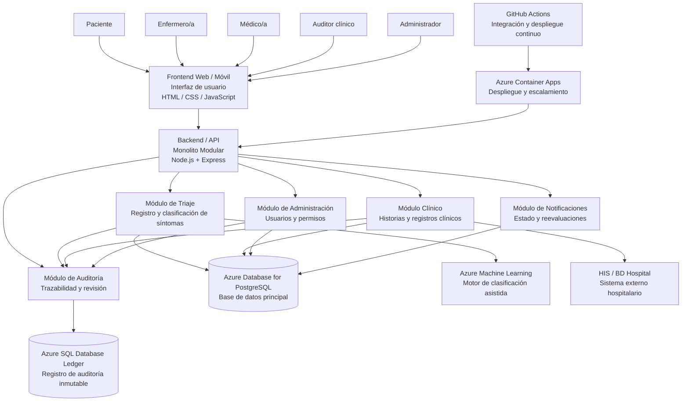

# C4 Nivel 2 — Diagrama de Contenedores MediTriage

## Propósito

El diagrama C4 de Nivel 2 representa los principales contenedores que conforman la solución MediTriage, mostrando cómo se relacionan entre sí, con los usuarios y con los sistemas externos.

La arquitectura definida para MediTriage corresponde a un **Monolito Modular**, donde las funcionalidades principales se organizan en módulos dentro de una misma aplicación Backend/API.

La solución se despliega utilizando **Microsoft Azure** y servicios gestionados para reducir la complejidad operativa y facilitar la escalabilidad, persistencia, auditoría e integración con inteligencia artificial.

---

## Diagrama de Contenedores

---

## Elementos del diagrama

### 1. Frontend Web / Móvil

Es la interfaz mediante la cual los usuarios interactúan con MediTriage.

Permite registrar información de los pacientes, consultar información clínica, visualizar prioridades y administrar las funcionalidades correspondientes según el rol del usuario.

**Tecnologías:** HTML, CSS y JavaScript.

---

### 2. Backend / API — Monolito Modular

Es el contenedor principal de la lógica de negocio de MediTriage.

La solución utiliza una arquitectura de **Monolito Modular**, por lo que los distintos módulos funcionales forman parte de una misma aplicación Backend/API.

**Tecnología:** Node.js + Express.

Dentro de este contenedor se organizan los siguientes módulos:

* Módulo de Triaje.
* Módulo Clínico.
* Módulo de Auditoría.
* Módulo de Administración.
* Módulo de Notificaciones.

El backend se despliega en **Azure Container Apps**, permitiendo utilizar infraestructura gestionada y escalamiento horizontal.

---

### 3. Módulo de Triaje

Se encarga de gestionar el registro y procesamiento de los síntomas del paciente y de la clasificación asistida.

Sus principales responsabilidades son:

* Registrar síntomas.
* Procesar la información ingresada.
* Solicitar la clasificación asistida mediante inteligencia artificial.
* Entregar la prioridad resultante para su visualización por el personal de enfermería.
* Registrar las acciones relevantes para auditoría.

**Servicio asociado:** Azure Machine Learning.

---

### 4. Módulo Clínico

Gestiona la información clínica utilizada por los profesionales de salud.

Sus principales responsabilidades son:

* Consultar historias clínicas.
* Gestionar registros clínicos.
* Acceder a información necesaria para la atención.
* Mantener la persistencia de la información clínica.

La información operativa y clínica se almacena en **Azure Database for PostgreSQL**.

También contempla la integración con el **HIS / BD Hospital** como sistema externo.

---

### 5. Módulo de Auditoría

Se encarga de registrar y mantener la trazabilidad de las acciones relevantes realizadas dentro del sistema.

Permite:

* Registrar eventos importantes.
* Mantener historial de acciones.
* Facilitar la revisión de registros clínicos.
* Mantener trazabilidad de las priorizaciones generadas.

Para los registros que requieren inmutabilidad y verificabilidad se utiliza **Azure SQL Database Ledger**.

---

### 6. Módulo de Administración

Gestiona las funciones administrativas de MediTriage.

Entre ellas se encuentran:

* Gestión de usuarios.
* Gestión de permisos.
* Administración de accesos.
* Configuración relacionada con los roles del sistema.

La información administrativa se almacena en **Azure Database for PostgreSQL**.

---

### 7. Módulo de Notificaciones

Gestiona las notificaciones relacionadas con el estado de atención y los procesos de espera.

Puede utilizarse para funcionalidades como:

* Informar el estado de espera del paciente.
* Notificar cambios relevantes.
* Apoyar procesos de reevaluación cuando corresponda.

La información necesaria para estas funcionalidades se mantiene en **Azure Database for PostgreSQL**.

---

## Servicios gestionados y tecnologías

Como parte de la estrategia cloud definida para MediTriage, se seleccionaron los siguientes servicios gestionados:

| Servicio                          | Uso dentro de MediTriage                                              |
| --------------------------------- | --------------------------------------------------------------------- |
| **Azure Container Apps**          | Despliegue y escalamiento de la aplicación                            |
| **Azure Database for PostgreSQL** | Persistencia de datos clínicos, síntomas, usuarios y datos operativos |
| **Azure SQL Database Ledger**     | Registro de auditoría inmutable y verificable                         |
| **Azure Machine Learning**        | Alojamiento y administración del motor de clasificación asistida      |
| **GitHub Actions**                | Integración continua, pruebas y despliegue                            |

---

## Relaciones principales

### Usuarios → Frontend

Los distintos tipos de usuarios acceden a MediTriage mediante la interfaz:

* **Paciente:** registra síntomas y consulta información correspondiente a su atención.
* **Enfermero/a:** visualiza la prioridad y gestiona procesos relacionados con el triaje.
* **Médico/a:** consulta información e historia clínica.
* **Auditor clínico:** revisa registros y trazabilidad.
* **Administrador:** gestiona usuarios, permisos y configuraciones.

---

### Frontend → Backend / API

El Frontend se comunica con el Backend/API para solicitar y enviar información relacionada con las funcionalidades de MediTriage.

---

### Backend / API → Módulos

El Backend organiza la lógica de negocio mediante módulos internos.

Estos módulos **no representan microservicios independientes**. Todos forman parte del mismo Monolito Modular.

Los principales módulos son:

* Triaje.
* Clínico.
* Auditoría.
* Administración.
* Notificaciones.

---

### Módulos → Azure Database for PostgreSQL

Los módulos que requieren persistencia utilizan **Azure Database for PostgreSQL** como base de datos relacional gestionada.

Se utiliza para almacenar:

* Síntomas.
* Formularios.
* Historias clínicas.
* Usuarios.
* Permisos.
* Información operativa.

---

### Auditoría → Azure SQL Database Ledger

El Módulo de Auditoría utiliza **Azure SQL Database Ledger** para mantener registros de auditoría verificables e inmutables.

Esto permite mantener la trazabilidad de acciones relevantes y de las priorizaciones generadas por el sistema.

---

### Triaje → Azure Machine Learning

El Módulo de Triaje se comunica con **Azure Machine Learning** para utilizar el motor de clasificación asistida basado en inteligencia artificial.

El resultado de esta clasificación sirve como apoyo para la priorización que posteriormente puede visualizar el personal de enfermería.

---

### Módulo Clínico → HIS / BD Hospital

El sistema contempla integración con el **HIS / BD Hospital** como sistema externo para acceder o intercambiar información clínica necesaria para el funcionamiento de MediTriage.

---

### GitHub Actions → Azure Container Apps

**GitHub Actions** automatiza los procesos de integración continua, pruebas y despliegue.

Una vez que las modificaciones cumplen las condiciones definidas, el proceso de CI/CD permite desplegar la aplicación en **Azure Container Apps**.

---

## Despliegue

El Backend/API de MediTriage se ejecuta mediante **Azure Container Apps**.

Este servicio permite desplegar la aplicación empaquetada en contenedores sin administrar directamente los servidores subyacentes.

Además, permite configurar escalamiento horizontal para responder ante aumentos de demanda, por ejemplo, durante períodos de alta cantidad de pacientes.

---

## Trazabilidad con el Backlog

El C4 Nivel 2 permite relacionar las funcionalidades del backlog con los módulos correspondientes:

| User Story                                     | Módulo / Container relacionado    |
| ---------------------------------------------- | --------------------------------- |
| **US-01 — Registrar síntomas**                 | Módulo de Triaje                  |
| **US-02 — Visualizar prioridad**               | Módulo de Triaje                  |
| **US-03 — Consultar historia clínica**         | Módulo Clínico                    |
| **US-04 — Auditar registros clínicos**         | Módulo de Auditoría               |
| **US-05 — Panel de administración y permisos** | Módulo de Administración          |
| **US-06 — Notificación de estado de espera**   | Módulo de Notificaciones          |
| **US-07 — Reevaluación por tiempo de espera**  | Módulo de Triaje / Notificaciones |
| **US-08 — Autenticación de dos factores**      | Módulo de Administración          |
| **US-09 — Cancelaciones voluntarias**          | Fuera del alcance actual          |
| **US-10 — Selección de idioma**                | Frontend Web / Móvil              |

---

## Flujo principal del sistema

El flujo general de MediTriage es:

1. El paciente ingresa al sistema mediante el Frontend.
2. Registra sus síntomas y la información solicitada.
3. El Frontend envía la información al Backend/API.
4. El Módulo de Triaje procesa los síntomas.
5. El sistema utiliza Azure Machine Learning para apoyar la clasificación.
6. La información y el resultado se almacenan en Azure Database for PostgreSQL.
7. El resultado puede ser visualizado por el personal de enfermería.
8. Las acciones relevantes son registradas mediante el Módulo de Auditoría.
9. Los registros de auditoría se mantienen en Azure SQL Database Ledger.
10. Los profesionales médicos pueden consultar la información clínica mediante el Módulo Clínico.

---

## Alcance del Nivel 2

Este diagrama representa:

* La interfaz de usuario.
* El Backend/API.
* La organización modular del monolito.
* Las bases de datos utilizadas.
* El motor de clasificación asistida.
* La integración con el sistema hospitalario.
* La infraestructura gestionada de Azure.
* El proceso de CI/CD.

El Nivel 2 **no representa componentes internos detallados del código**, ya que ese nivel de detalle corresponde al C4 Nivel 3.

---

## Decisiones arquitectónicas reflejadas

El C4 Nivel 2 refleja las decisiones tomadas durante S04:

* **Proveedor cloud:** Microsoft Azure.
* **Estilo arquitectónico:** Monolito Modular.
* **Despliegue:** Azure Container Apps.
* **Persistencia:** Azure Database for PostgreSQL.
* **Auditoría:** Azure SQL Database Ledger.
* **Inteligencia artificial:** Azure Machine Learning.
* **CI/CD:** GitHub Actions.

La utilización de servicios gestionados busca reducir la carga operativa del equipo y facilitar el despliegue, escalabilidad, persistencia, auditoría e integración con inteligencia artificial.

---

## Consideraciones 12-Factor

El diseño del Nivel 2 considera las propuestas definidas en el checklist 12-Factor:

* Uso de servicios externos como recursos acoplables.
* Configuración mediante variables de entorno y secretos.
* Separación entre construcción y despliegue.
* Procesos sin estado persistente en el Backend.
* Uso de `process.env.PORT` para el puerto de ejecución.
* Escalamiento horizontal mediante Azure Container Apps.
* Graceful shutdown para cierre seguro de conexiones.
* Uso de Docker para mantener paridad entre desarrollo y producción.
* Registro de eventos mediante stdout/stderr.
* Ejecución de procesos administrativos en el entorno de ejecución.

Estas medidas permiten que el Monolito Modular pueda ejecutarse de manera compatible con el enfoque cloud-native definido para el proyecto.

