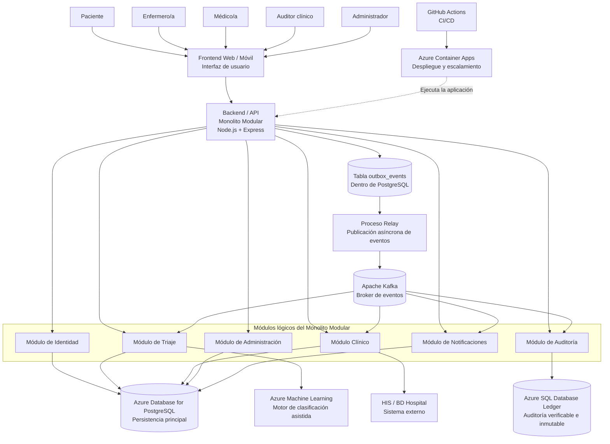

# C4 Nivel 2 — Diagrama de Contenedores MediTriage

## 1. Propósito

El diagrama C4 de Nivel 2 representa la arquitectura de contenedores de MediTriage, sus tecnologías principales y las relaciones entre los usuarios, la aplicación, las bases de datos, el motor de inteligencia artificial y el broker de eventos.

MediTriage utiliza una arquitectura de **Monolito Modular**, desplegada en Microsoft Azure. La lógica de negocio se organiza en módulos que comparten una aplicación Backend/API, mientras que la persistencia y el intercambio de eventos se apoyan en servicios específicos.

Las decisiones arquitectónicas consideradas son:

* **Proveedor cloud:** Microsoft Azure.
* **Estilo arquitectónico:** Monolito Modular.
* **Base de datos principal:** Azure Database for PostgreSQL.
* **Auditoría:** Azure SQL Database Ledger.
* **Inteligencia artificial:** Azure Machine Learning.
* **Broker de eventos:** Apache Kafka.
* **Patrones de consistencia:** Outbox.
* **Patrón de consultas y comandos:** CQRS.
* **Despliegue:** Azure Container Apps.
* **Integración y despliegue continuo:** GitHub Actions.

---

## 2. Diagrama de contenedores

```mermaid
flowchart TB

    %% Usuarios
    paciente["Paciente"]
    enfermero["Enfermero/a"]
    medico["Médico/a"]
    auditor["Auditor clínico"]
    admin["Administrador"]

    %% Aplicación
    frontend["Frontend Web / Móvil<br/>Interfaz de usuario"]

    backend["Backend / API<br/>Monolito Modular<br/>Node.js + Express"]

    %% Módulos lógicos del backend
    subgraph MODULOS["Módulos lógicos del Monolito Modular"]
        identidad["Módulo de Identidad"]
        triaje["Módulo de Triaje"]
        clinico["Módulo Clínico"]
        administracion["Módulo de Administración"]
        auditoria["Módulo de Auditoría"]
        notificaciones["Módulo de Notificaciones"]
    end

    %% Persistencia
    postgres[("Azure Database for PostgreSQL<br/>Persistencia principal")]

    outbox[("Tabla outbox_events<br/>Dentro de PostgreSQL")]

    ledger[("Azure SQL Database Ledger<br/>Auditoría verificable e inmutable")]

    %% Eventos
    relay["Proceso Relay<br/>Publicación asíncrona de eventos"]

    kafka[("Apache Kafka<br/>Broker de eventos")]

    %% Inteligencia artificial
    ia["Azure Machine Learning<br/>Motor de clasificación asistida"]

    %% Sistema externo
    his["HIS / BD Hospital<br/>Sistema externo"]

    %% Infraestructura
    aca["Azure Container Apps<br/>Despliegue y escalamiento"]

    cicd["GitHub Actions<br/>CI/CD"]

    %% Acceso de usuarios
    paciente --> frontend
    enfermero --> frontend
    medico --> frontend
    auditor --> frontend
    admin --> frontend

    frontend --> backend

    %% Organización modular
    backend --> identidad
    backend --> triaje
    backend --> clinico
    backend --> administracion
    backend --> auditoria
    backend --> notificaciones

    %% Persistencia
    identidad --> postgres
    triaje --> postgres
    clinico --> postgres
    administracion --> postgres
    notificaciones --> postgres

    %% Outbox
    backend --> outbox
    outbox --> relay
    relay --> kafka

    %% Eventos consumidos
    kafka --> triaje
    kafka --> clinico
    kafka --> auditoria
    kafka --> notificaciones

    %% Auditoría
    auditoria --> ledger

    %% IA
    triaje --> ia

    %% Integración externa
    clinico --> his

    %% Despliegue
    aca -. "Ejecuta la aplicación" .-> backend
    cicd --> aca
```

**Nota arquitectónica:** los módulos del diagrama son divisiones lógicas de una misma aplicación; no representan microservicios desplegados de forma independiente. El proceso Relay representa la función encargada de publicar los eventos pendientes de la tabla Outbox. Su despliegue específico deberá definirse según la implementación.

---

## 3. Descripción de los elementos

### 3.1. Frontend Web / Móvil

Interfaz mediante la cual los usuarios interactúan con MediTriage.

Permite registrar información del paciente, ingresar síntomas, visualizar prioridades, consultar información clínica y acceder a las funciones correspondientes a cada rol.

Se comunica con el Backend/API para enviar solicitudes y recibir los resultados.

### 3.2. Backend / API

Es el contenedor principal de la lógica de negocio de MediTriage.

**Tecnologías:** Node.js y Express.

Implementa el estilo arquitectónico de Monolito Modular. Los módulos de Identidad, Triaje, Clínico, Administración, Auditoría y Notificaciones pertenecen a la misma aplicación.

El Backend coordina las operaciones de negocio, la persistencia en PostgreSQL, la interacción con el motor de inteligencia artificial y la generación de eventos de dominio.

### 3.3. Módulo de Identidad

Gestiona la identificación de pacientes y usuarios.

Responsabilidades principales:

* Registro de pacientes.
* Gestión de datos personales.
* Identificación de pacientes.
* Gestión de usuarios y roles.

**Entidades relacionadas:** `Paciente`, `Usuario` y `Rol`.

### 3.4. Módulo de Triaje

Gestiona la clasificación inicial de pacientes según su nivel de urgencia.

Responsabilidades principales:

* Recepción de síntomas.
* Captura de signos vitales.
* Solicitud de clasificación asistida.
* Recepción de resultados de inteligencia artificial.
* Confirmación o modificación de la clasificación por enfermería.
* Priorización de pacientes.

Se comunica con Azure Machine Learning y utiliza PostgreSQL para mantener los datos correspondientes al proceso.

**Eventos relacionados:** `sintomas.reportados`, `vitals.captured`, `triage.requested`, `triage.completed`, `triage.confirmed` y `triage.modified`.

### 3.5. Módulo Clínico

Gestiona la información clínica utilizada durante la atención.

Responsabilidades principales:

* Gestión de encuentros de atención.
* Consulta de historias clínicas.
* Registro de información clínica.
* Seguimiento del estado de atención.
* Consulta de síntomas y signos vitales.

**Entidades relacionadas:** `Atencion`, `Sintomas` y `SignosVitales`.

Utiliza PostgreSQL como base de datos principal y contempla la integración con el HIS / BD Hospital como sistema externo.

### 3.6. Módulo de Administración

Gestiona usuarios, roles, permisos y funciones administrativas.

Su información se mantiene en PostgreSQL, de acuerdo con el modelo de persistencia definido para el proyecto.

### 3.7. Módulo de Auditoría

Mantiene la trazabilidad de las acciones relevantes del sistema.

Responsabilidades principales:

* Registrar eventos de dominio relevantes para auditoría.
* Registrar el seguimiento de las decisiones generadas por inteligencia artificial.
* Facilitar la revisión de las actividades realizadas.
* Mantener trazabilidad de las acciones clínicas.

Para los registros que requieren verificabilidad e inmutabilidad se utiliza Azure SQL Database Ledger.

### 3.8. Módulo de Notificaciones

Gestiona las comunicaciones relacionadas con el proceso de atención.

Responsabilidades principales:

* Notificaciones sobre el estado de espera.
* Alertas de reevaluación.
* Mensajes informativos relacionados con la atención.

Puede consumir eventos del broker para reaccionar a cambios relevantes en el flujo de atención.

---

## 4. Estrategia de persistencia

### 4.1. Azure Database for PostgreSQL

Es el motor principal de persistencia de MediTriage.

Se seleccionó porque los datos del sistema están relacionados entre sí y requieren integridad referencial y transacciones ACID.

El modelo entidad-relación contempla las siguientes tablas principales:

| Tabla            | Propósito                                                                     |
| ---------------- | ----------------------------------------------------------------------------- |
| `Paciente`       | Información personal, RUT, nombre, fecha de nacimiento y condiciones crónicas |
| `Personal`       | Identificación del personal, RUT, nombre y rol                                |
| `Atencion`       | Encuentros de atención, paciente, personal, estado y fecha                    |
| `SignosVitales`  | Presión sanguínea, pulsaciones, temperatura, saturación de oxígeno y fecha    |
| `Sintomas`       | Descripción de síntomas, atención asociada, severidad y fecha                 |
| `DecisionTriage` | Nivel ESI, justificación de IA, responsable de confirmación y fecha           |

Las tablas `SignosVitales`, `Sintomas` y `DecisionTriage` se relacionan con `Atencion` mediante `atencion_id`. La tabla `Atencion` relaciona al paciente mediante `paciente_rut` y al personal mediante `personal_id`.

PostgreSQL también almacenará los registros necesarios para implementar el patrón Outbox.

### 4.2. Azure SQL Database Ledger

Se utiliza para mantener registros de auditoría verificables e inmutables.

Su función es complementar la persistencia principal con trazabilidad de las decisiones y acciones relevantes.

**PostgreSQL mantiene el estado operativo actual; Azure SQL Database Ledger respalda las necesidades de auditoría inmutable.**

### 4.3. Redis

Redis se considera una posibilidad futura para escenarios de caché y visualización en tiempo real.

No se representa como servicio implementado actualmente, porque el ADR-0004 establece que podrá incorporarse posteriormente.

---

## 5. Broker de eventos: Apache Kafka

Apache Kafka es el broker seleccionado para el intercambio de eventos de dominio entre los distintos contextos del sistema.

Permite almacenar eventos de forma persistente, desacoplar productores y consumidores, y reproducir eventos cuando sea necesario para procesos de auditoría o recuperación.

Entre los eventos principales definidos en el catálogo se encuentran:

* `paciente.registrado`
* `encounter.started`
* `sintomas.reportados`
* `vitals.captured`
* `triage.requested`
* `triage.completed`
* `triage.confirmed`
* `triage.modified`
* `paciente.cola`
* `paciente.llamado`
* `historial.visto`
* `paciente.atendido`

Los eventos son inmutables e incluyen un `trace_id` para facilitar la trazabilidad.

### Productores y consumidores

| Evento                | Productor                     | Consumidores principales           |
| --------------------- | ----------------------------- | ---------------------------------- |
| `paciente.registrado` | Identidad                     | Clínico y Auditoría                |
| `encounter.started`   | Clínico                       | Persistencia de la atención        |
| `sintomas.reportados` | Flujo de registro de síntomas | Motor IA y Auditoría               |
| `vitals.captured`     | Clínico / Enfermería          | Motor IA                           |
| `triage.requested`    | Clínico                       | Azure Machine Learning             |
| `triage.completed`    | Motor IA                      | Clínico y Auditoría                |
| `triage.confirmed`    | Clínico / Enfermería          | Tablero de espera y Auditoría      |
| `triage.modified`     | Clínico / Enfermería          | Tablero de espera y Auditoría      |
| `paciente.cola`       | Clínico                       | Visualización de la sala de espera |
| `paciente.llamado`    | Clínico / Médico              | Pantallas de sala de espera        |
| `historial.visto`     | Clínico / Médico              | Auditoría                          |
| `paciente.atendido`   | Clínico / Médico              | Persistencia y tablero de espera   |

Los consumidores indicados reflejan las responsabilidades descritas en el catálogo de eventos. La implementación final deberá definir los topics y grupos de consumidores concretos de Kafka.

---

## 6. Consistencia entre PostgreSQL y Kafka: patrón Outbox

La escritura de datos en PostgreSQL y la publicación de eventos en Kafka no constituye una única operación atómica. Por esta razón, MediTriage adopta el patrón **Outbox**.

El funcionamiento definido es el siguiente:

1. El Backend procesa una operación de negocio.
2. Dentro de una misma transacción de PostgreSQL, guarda los cambios de negocio y el evento correspondiente en la tabla `outbox_events`.
3. Cuando la transacción se confirma, los cambios y el evento pendiente quedan almacenados.
4. Un proceso Relay consulta los eventos pendientes de la tabla Outbox.
5. El Relay publica los eventos en Apache Kafka de forma asíncrona.
6. Los consumidores procesan los eventos utilizando mecanismos de idempotencia para gestionar posibles entregas duplicadas.

Este mecanismo busca evitar la pérdida de eventos causada por fallos entre la escritura de datos y su publicación en el broker.

La garantía prevista es **At-Least-Once**: los eventos pueden entregarse más de una vez, por lo que los consumidores deben evitar procesar duplicados como si fueran operaciones nuevas.

---

## 7. Patrones arquitectónicos aplicados

### 7.1. CQRS

Se adopta CQRS para separar las operaciones de escritura de las operaciones de lectura.

Esto permite diferenciar las transacciones clínicas de las consultas utilizadas por médicos y enfermería.

El ADR-0004 no define una tecnología independiente para las vistas de lectura; por lo tanto, el diagrama no incorpora una base de datos adicional para CQRS.

### 7.2. Outbox

Se utiliza para mantener la consistencia entre las transacciones de PostgreSQL y la publicación de eventos en Kafka.

La tabla `outbox_events` almacena los eventos pendientes dentro de la misma transacción que modifica los datos de negocio.

### 7.3. Saga

No se implementa en esta etapa, porque el MVP no requiere procesos distribuidos complejos.

### 7.4. Event Sourcing

No se implementa inicialmente. La auditoría requerida se aborda mediante Azure SQL Database Ledger y el registro de eventos de dominio.

---

## 8. Servicios gestionados e infraestructura

| Servicio o tecnología         | Responsabilidad                                             |
| ----------------------------- | ----------------------------------------------------------- |
| Azure Container Apps          | Despliegue de la aplicación y configuración de escalamiento |
| Azure Database for PostgreSQL | Persistencia relacional principal                           |
| Azure SQL Database Ledger     | Auditoría verificable e inmutable                           |
| Azure Machine Learning        | Motor de clasificación asistida por IA                      |
| Apache Kafka                  | Broker de eventos de dominio                                |
| GitHub Actions                | Automatización de integración, pruebas y despliegue         |

GitHub Actions automatiza el flujo de CI/CD y permite desplegar la aplicación en Azure Container Apps una vez cumplidas las condiciones definidas para la integración y las pruebas.

El ADR-0004 selecciona Apache Kafka como broker, pero no especifica un proveedor o servicio gestionado para alojarlo. Por eso se representa como tecnología de mensajería sin atribuirle un servicio de Azure no confirmado.

---

## 9. Flujo principal de datos y eventos

El flujo general de una clasificación de paciente es el siguiente:

1. El paciente ingresa sus datos y reporta sus síntomas desde el Frontend.
2. El Backend recibe la información y la procesa mediante los módulos correspondientes.
3. Los datos de negocio se guardan en PostgreSQL.
4. En la misma transacción se registra el evento correspondiente en `outbox_events`.
5. El proceso Relay publica el evento en Kafka.
6. Los consumidores reciben los eventos que necesitan para ejecutar sus responsabilidades.
7. El Módulo de Triaje utiliza Azure Machine Learning para obtener una clasificación asistida.
8. El resultado se registra en el sistema y queda disponible para su revisión por enfermería.
9. Las decisiones y acciones relevantes se registran para auditoría.
10. Los eventos relacionados con la espera, el llamado y la finalización de la atención permiten actualizar los procesos de seguimiento correspondientes.

---

## 10. Trazabilidad con el backlog

| User Story                                  | Módulo relacionado       |
| ------------------------------------------- | ------------------------ |
| US-01 — Registrar síntomas                  | Identidad / Triaje       |
| US-02 — Visualizar prioridad                | Triaje                   |
| US-03 — Consultar historia clínica          | Clínico                  |
| US-04 — Auditar registros clínicos          | Auditoría                |
| US-05 — Panel de administración y permisos  | Administración           |
| US-06 — Notificaciones del estado de espera | Notificaciones           |
| US-07 — Reevaluación por tiempo de espera   | Triaje / Notificaciones  |
| US-08 — Autenticación de dos factores       | Administración           |
| US-09 — Registrar cancelaciones voluntarias | Fuera del alcance actual |
| US-10 — Selección de idioma                 | Frontend Web / Móvil     |

---

## 11. Consideraciones de despliegue

El Backend/API se despliega mediante Azure Container Apps.

La solución debe seguir las propuestas del checklist 12-Factor, incluyendo:

* Configuración mediante variables de entorno y gestión segura de secretos.
* Separación entre construcción, publicación y ejecución.
* Procesos sin estado persistente en memoria.
* Uso del puerto asignado mediante `process.env.PORT`.
* Escalamiento horizontal según la demanda.
* Cierre seguro de conexiones y procesos.
* Registro de logs mediante stdout/stderr.
* Consistencia entre entornos de desarrollo y producción.

La ubicación concreta de Kafka y la forma de desplegar el proceso Relay deberán definirse en la implementación. El diagrama refleja las responsabilidades arquitectónicas acordadas, sin asumir decisiones de infraestructura que todavía no aparecen en los ADR proporcionados.

---

## 12. Alcance del Nivel 2

Este diagrama representa:

* La interfaz de usuario.
* El Backend/API y su organización modular.
* La persistencia relacional principal.
* El almacenamiento de auditoría inmutable.
* El motor de clasificación asistida.
* El broker de eventos.
* El patrón Outbox y el proceso Relay.
* Las relaciones principales entre los módulos y los servicios externos.
* La infraestructura de despliegue y el proceso de CI/CD.

Los detalles internos del código, las clases y la estructura detallada de cada módulo corresponden al Nivel 3 de C4.

---

## 13. Decisiones arquitectónicas reflejadas

El C4 Nivel 2 incorpora las decisiones de los ADR-0003 y ADR-0004:

* Microsoft Azure como proveedor cloud.
* Monolito Modular como estilo arquitectónico.
* PostgreSQL como base de datos principal.
* Azure SQL Database Ledger para auditoría.
* Apache Kafka como broker de eventos.
* CQRS para separar lecturas y escrituras.
* Outbox para mantener la consistencia entre PostgreSQL y Kafka.
* Azure Machine Learning para clasificación asistida.
* Azure Container Apps para el despliegue.
* GitHub Actions para CI/CD.

Estas decisiones buscan equilibrar seguridad, disponibilidad, rendimiento, trazabilidad y capacidad de evolución, manteniendo una arquitectura adecuada para el MVP de MediTriage.

